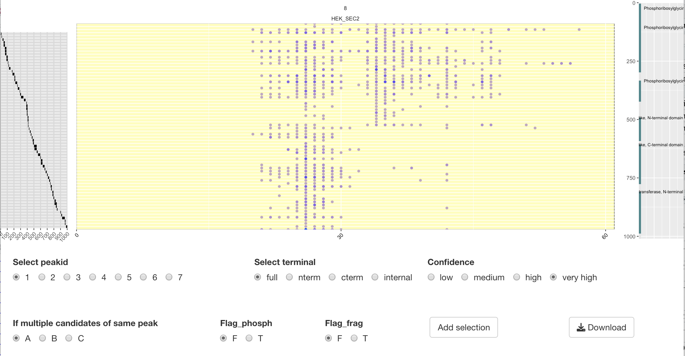

# peptide_elutions

Analysis accompanying "Alternative proteoforms and proteoform-dependent assemblies in humans and plants"

Claire D. McWhite, Wisath Sae-Lee, Yawning Yuan, Anna L. Mallam, 
Nicolas A. Gort Freitas, Silvia Ramundo, Masayuki Onishi, and Edward M. Marcotte

The proteoform analysis comprises of 3 parts: processing, scoring, and vizualizing.  

### Input data
**1. peptide information from fractionation experiment**<Enter>
	
If the fractionation experiment was analyzed with MSFragger, run the following script to combine data from each fraction into one single file.<Enter> 

Example code: python3 /scripts/format_MSFragger_files.py --root_folder **folder where your results from MSFragger analysis are located** --fractionation_name **name of your fractionation experiment** --output_file **name of outputfile wide format** --fraction_order **name of outputfile fraction order file**

Expected result:<Enter> 

	
**2. In-silico digest peptides**
	
Example code: python2.7 /scripts/trypsin.py --input_file /test/uniprot_human.fasta --output_file uniprot_human_digested.csv --miss 2 --positions True
	
Expected result:<Enter>
	

### Processing
Process peptide files for Gaussian fitting 
Script: peptide_identification_single_frac.R <Enter> 

Input file: <Enter> 

Example code: Rscript-4.0.3 /scripts/peptide_identification_single_frac.R --elut_wide_file /data/pivot_test.csv --fraction_order /data/fraction_order_test.csv --peps /data/uniprot_human_digested.csv --seqlen /data/seq_length_homo_sapiens.tsv --spec human --output_file /data/short_tidy_unique_MB_sup_SEC.csv  

Expected result:<Enter> 

### Scoring
1. Idenitfy peaks from peptide elution profile of each protein in a fractionation experiment using Gaussian Mixture Model. Multiple peaks suggest the existence of proteoforms or intact proteins eluting with different binding partners. <Enter> 
	
Script: Gaussian_fitting.R <Enter> 
	
Input file: <Enter> 
 <Enter> 

Example code: Rscript-4.0.3 /scripts/Gaussian_fitting.R --input_file example/short_tidy_unique_anna_hekSEC2.csv --simple_AdapGauss /scripts/simple_AdaptGauss.R --output_file example/short_tidy_unique_anna_hekSEC2_peaks.csv <Enter> 

Expected result:<Enter> 
	

2. Calculate terminal bias score in order to prioritize proteins to inspect manually.

Input file 

1.peptide file (Same as input file for Gaussian fitting step)

Input file: <Enter> 
 <Enter> 

2.peak file (From previous Gaussian fitting step)

Example code: Rscript-4.0.3 scripts/terminal_bias_fix2.R --input_file /test/short_tidy_unique_anna_hekSEC2_78.csv --peaks /peaks_short_tidy_unique_anna_hekSEC2_78.csv --output_file /test/terminal_bias_short_tidy_unique_anna_hekSEC2_78.csv <Enter>

Expected result:<Enter> 

### Visual caterogizing

Visualize proteins with terminal bias score>2 through a Shiny app. The example below demonstrates how to view peptide elution profile for PUR2 from HEK293T cell fractionation.
	
Input file 
1. The same input file as the first step in scoring.
	
 <Enter> 
	
2. Domain information
	

Expected result:<Enter> 

